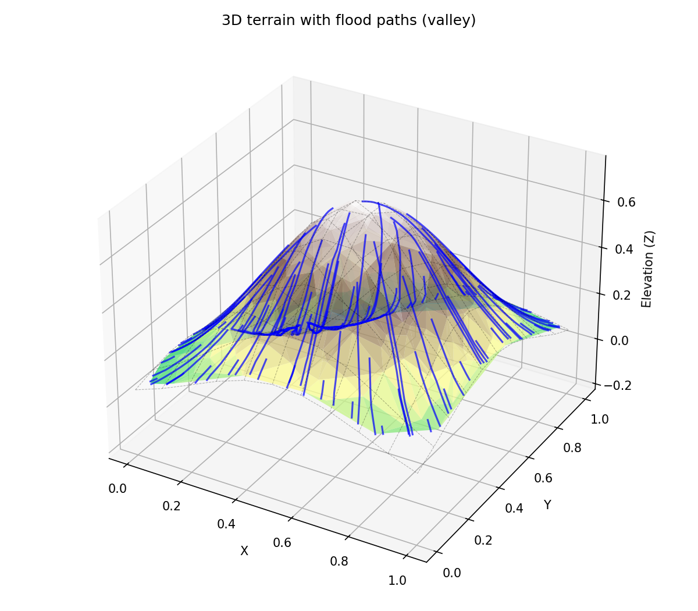
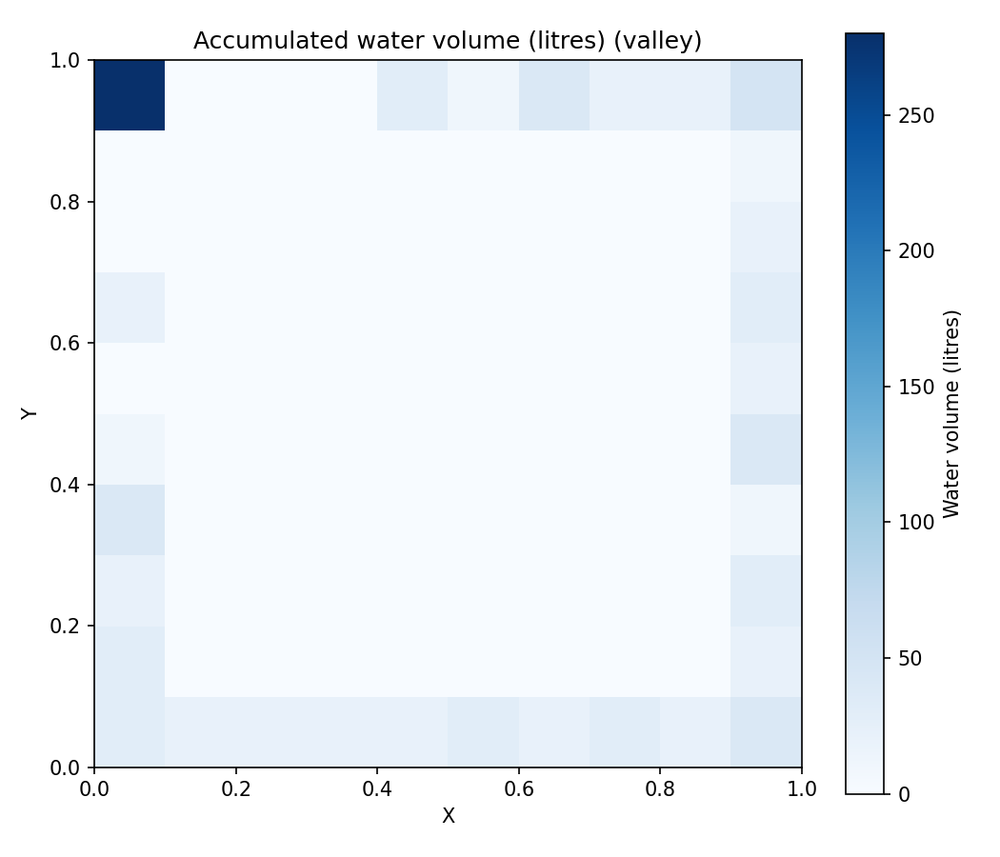
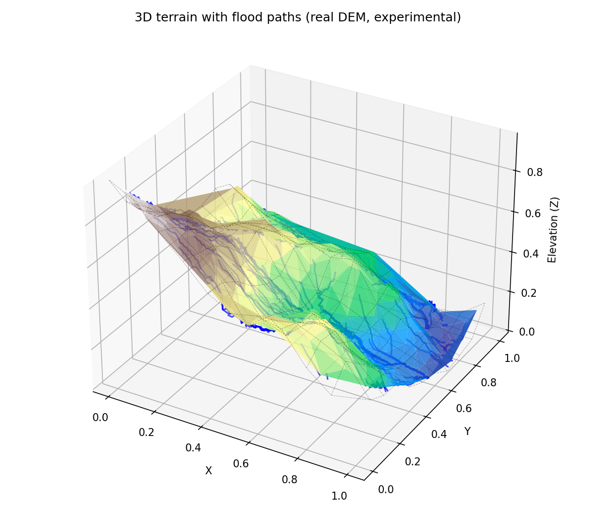
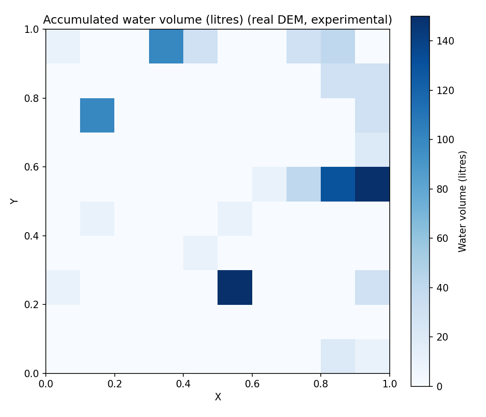

# 3D Mountain Simulation: Predicting Flood Paths

Trace where rain flows over a triangulated 3D terrain and map the cells where it pools.

<p align="center">
  
  
</p>

[](LICENSE)

## Overview

Bachelor's thesis in Computer Engineering at Shiraz University (Summer 2024), graded 20/20; the full report is [docs/thesis.pdf](docs/thesis.pdf).
The project reconstructs a 3D surface from scattered 2D points with Delaunay triangulation, computes the downhill direction of every triangle by fitting a plane through its vertices, and traces where rain released in each grid cell flows.
The water is accumulated in the cell where each path stops, which gives a simple prediction of flood-prone areas.
Everything is implemented with NumPy, SciPy and Matplotlib in a small package, `floodsim`, driven by one command-line script.

## Method

1. **Terrain generation.** 400 points are sampled uniformly in the unit square (seeded, so runs are reproducible) and lifted to 3D with a closed-form terrain function: a Gaussian peak, a cone, two peaks, sine ridges, a crater, a plateau, or a mountain with a valley (the default). An eighth option uses Perlin noise.
2. **Delaunay triangulation** of the 2D points (`scipy.spatial.Delaunay`) turns them into a triangle mesh.
3. **Per-triangle gradient.** For each triangle a plane `z = ax + by + c` is fitted through its three vertices by least squares; `(-a, -b)` is the downhill direction of that triangle.
4. **Flood-path tracing.** From the centre of every cell of a 10 x 10 grid a drop moves by `0.01` times the downhill vector of the triangle it is in. Tracing stops when the drop leaves the triangulation or the simulation area, lands on a flat triangle, or after 100 steps.
5. **Water accumulation.** Every cell receives 10 litres of rain, which is added to the cell containing the end of its path. The result is drawn as a heatmap in the same X/Y frame as the 3D plot.

## Results

The figures above are the default run (`valley` terrain, seed 42). The paths run down the central peak; the water collects in the low north-west corner that the valley drains into (280 of the 1000 litres end in that single cell) and along the edges of the domain where paths leave the triangulated area, while the peak and its slopes stay dry.
The thesis report shows the same simulation on all seven terrain functions.

## Usage

Tested with Python 3.11.

```bash
pip install -r requirements.txt
python run.py
```

This writes `docs/terrain_flood_paths.png` and `docs/water_volume.png`. Other terrains and settings:

```bash
python run.py --terrain gaussian --out output/gaussian
python run.py --terrain ridges --points 800 --grid 20 --seed 7 --out output/ridges
python run.py --terrain perlin --seed 3 --out output/perlin --show
```

`--show` also opens the figures in a window. Run `python run.py --help` for all options.

**Experimental: real elevation data.** `examples/run_on_dem.py` crops a window from an SRTM GeoTIFF tile, normalises it to the unit square and runs the unchanged pipeline on it. It needs `rasterio` (`pip install rasterio==1.3.11`) and a tile downloaded from the USGS EarthExplorer or OpenTopography (SRTM 1 Arc-Second Global; tile N29E052 covers Shiraz). The default window is the Derak mountain north-west of Shiraz:

```bash
python examples/run_on_dem.py --dem N29E052.tif --out output/derak
```

<p align="center">
  
  
</p>

## Project structure

```
run.py                    command-line entry point
src/floodsim/terrain.py   the eight terrain functions and point sampling
src/floodsim/mesh.py      Delaunay triangulation, per-triangle plane fit
src/floodsim/flow.py      flood-path tracing, water accumulation on the grid
src/floodsim/plot.py      3D terrain with paths, water heatmap (saved as PNG)
examples/run_on_dem.py    experimental run on a real SRTM tile
docs/                     thesis.pdf and the generated figures
```

The original thesis scripts (`Part1.py`, `Part2.py`) are kept in the git history.

## Limitations and future work

- The terrain is synthetic: the thesis uses closed-form functions on the unit square, not measured elevation. The DEM example is a first, experimental step towards real input.
- Rain is a fixed volume per cell with no infiltration, evaporation, flow rate or time dimension; water simply moves to where its path ends.
- The descent is first-order with a fixed step and a per-triangle constant gradient. Paths that reach a local minimum jitter around it until the step limit, and very thin triangles near the hull produce large gradients and long jumps.
- Water that reaches the edge of the triangulated area is counted in the edge cell, so the domain boundary acts as a sink.
- Next steps: real DEM input (for example SRTM) as a first-class option, rasterised flow accumulation such as the D8 algorithm, and a comparison against an established hydrology tool.

## License

MIT, see [LICENSE](LICENSE).

## Citation

```bibtex
@thesis{monshizadeh2024flood,
  author = {Monshizadeh, Matin},
  title  = {3D Mountain Simulation with Flood Paths and Accumulated Water Volume},
  type   = {Bachelor's thesis},
  school = {Shiraz University},
  year   = {2024},
  note   = {Supervisor: Mohammad Taheri},
  url    = {https://github.com/matinmonshizadeh/3d-mountain-simulation-predicting-flood-paths}
}
```
